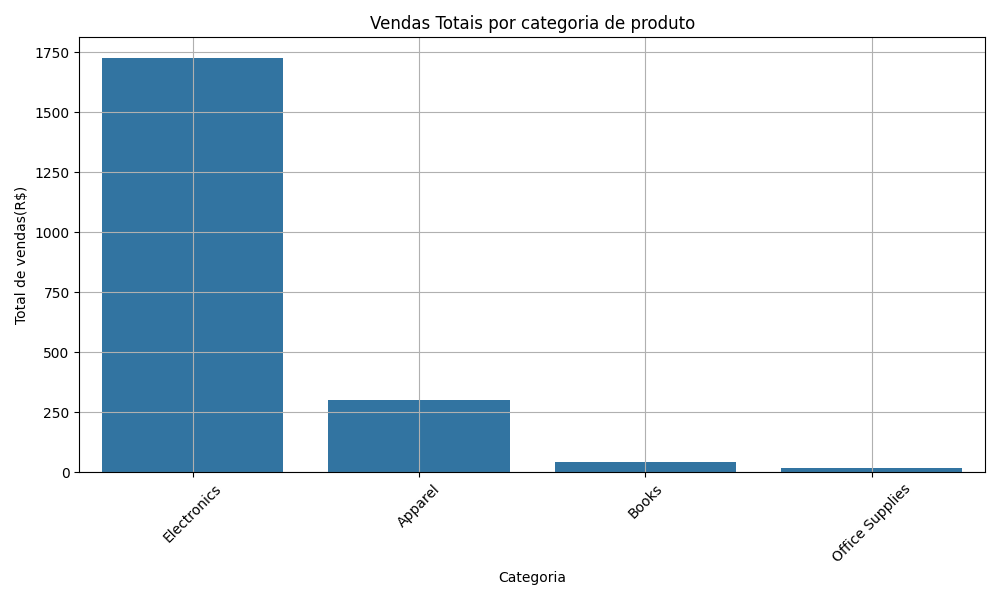
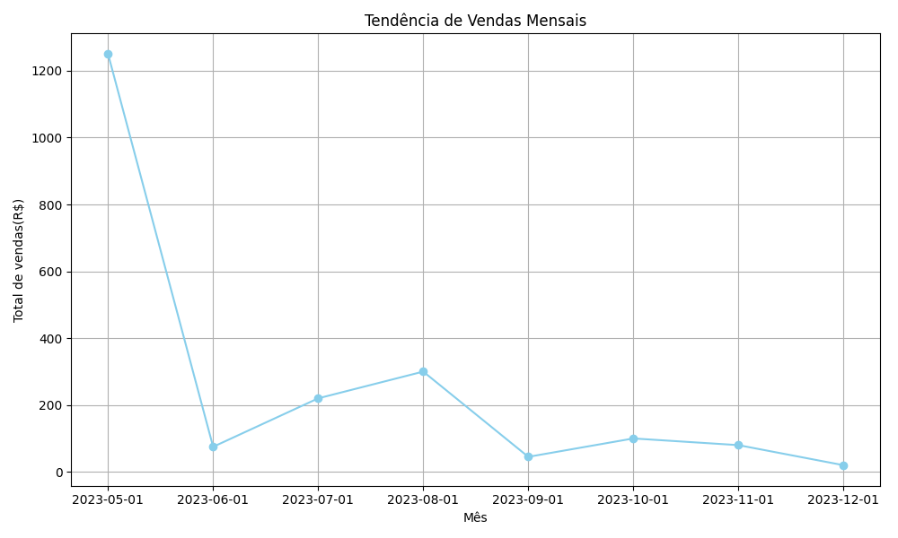

# Análise de Dados de Vendas com Pandas

Este repositório demonstra habilidades em manipulação, limpeza e análise de dados usando a biblioteca Pandas do Python, juntamente com visualização de dados com Matplotlib e Seaborn. O projeto foca na análise de um conjunto de dados simulado de vendas para extrair insights e tendências.

## Funcionalidades Exploradas

* **Carregamento de Dados:** Leitura de arquivos CSV.
* **Limpeza e Pré-processamento de Dados:**
    * Renomear colunas para padronização.
    * Conversão de tipos de dados (e.g., strings para datas).
    * Tratamento de valores duplicados.
    * Criação de novas colunas (e.g., `total_price`).
* **Análise Exploratória de Dados (EDA):**
    * Cálculo de métricas sumárias (total de vendas, quantidade vendida).
    * Agrupamento de dados para análise por categoria, região, produto.
    * Análise de tendências temporais (vendas mensais).
* **Visualização de Dados:**
    * Geração de gráficos de barras para vendas por categoria/região.
    * Geração de gráficos de linha para tendências de vendas ao longo do tempo.


## Como Executar o Projeto Localmente

1.  **Clone o repositório:**
    ```bash
    git clone [https://github.com/Jhonathan-Ferroni/pandas_sales_analysis.git](https://github.com/Jhonathan-Ferroni/pandas_sales_analysis.git)
    cd pandas_sales_analysis
    ```

   2.  **Crie e ative um ambiente virtual (recomendado):**
        ```bash
               a.python -m venv venv
       
               *Windows*:
               .\venv\Scripts\activate
       
               *macOS/Linux*:
               source venv/bin/activate

   3.  **Instale as dependências:**
        ```bash
        pip install -r requirements.txt
        ```

    4.  **Execute o script principal:**
        ```bash
        python src/main.py
        ```
        Isso irá carregar os dados, realizar as análises e gerar os gráficos, que serão salvos na raiz do projeto (e também exibidos, dependendo do seu ambiente).

    ## Resultados da Análise (Exemplos)

    * **Total de Vendas:** R$ X,XXX.XX
    * **Vendas por Categoria:**
        * Electronics: R$ 1725.00
        * Apparel: R$ 300.00
        * Books: R$ 45.00
        * Office Supplies: R$20.00
    * **Gráficos Gerados:**
        * `sales_by_category.png`: [](sales_by_category.png)
        * `monthly_sales_trend.png`: [](monthly_sales_trend.png)

    # Aprendizados com Pandas

    Durante o desenvolvimento deste projeto, explorei e solidifiquei meu entendimento sobre:

    * **DataFrames e Series:** Estruturas de dados fundamentais do Pandas.
    * **Operações Básicas:** Leitura, seleção, filtragem, adição/remoção de colunas.
    * **Limpeza de Dados:** `pd.to_datetime()`, `dropna()`, `drop_duplicates()`, `rename()`.
    * **Agregação:** `groupby()`, `sum()`, `mean()`, `sort_values()`.
    * **Visualização:** Integração com Matplotlib e Seaborn para insights visuais.
    * **Melhores Práticas:** Modularização de código, uso de ambientes virtuais.


